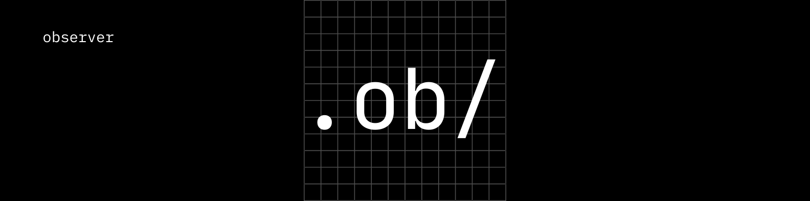
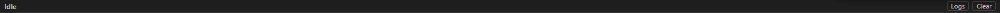

# 📦 **Observer**

### *A fast, offline Windows application for automatically tagging, organizing, and browsing images using local machine learning.*



---

## 🔍 **Overview**

**Observer** is a Windows desktop application built in **Go** and **React** using the **Wails** framework.
It provides **AI-powered offline image tagging**, allowing users to quickly search, browse, and organize large photo collections with zero cloud dependency.

Observer is designed for:

* 📸 **Photographers**
* 🗂 **Screenshot hoarders**
* 💼 **Professionals who manage image-heavy workflows**
* 🔒 **Privacy-conscious users who want 100% offline ML**

Using an optimized ONNX model (**EfficientNet-Lite4**), Observer generates fast and accurate descriptive labels for every image—all computed locally through an embedded Python environment.

---

# 🚀 **Features**

## 🤖 **AI Auto-Tagging**

Observer uses **EfficientNet-Lite4 ONNX** + **ONNX Runtime (DirectML/GPU + CPU fallback)** to automatically tag images.
Supports extracting the **top 5 predictions** per image.

* Offline inference
* GPU acceleration via DirectML when available
* CPU fallback for any Windows machine
* Fully embedded Python runtime (no external installation required)

---

## 🗂️ **Smart Image Organization**

* Scan folders recursively
* Display all images in an interactive grid
* Manage tagged vs untagged images
* Efficient SQLite database storage
* Real-time filtering and searching
* Sort images by name, size, date created, date modified

---

## ⚡ **High-Performance Local Thumbnailing**

Observer generates local thumbnails using Go's image processing library.

* No network
* No external dependencies
* Cached in `observer/thumbnails`
* Auto-regenerated only when missing

---

## 🔧 **Background Workers (Caption Workers)**

Observer includes a built-in job system with:

* Worker queue for image tagging
* Parallel background workers
* Persistent work until completion
* Safe cancellation on app shutdown
* Progress reporting to the UI

---

## 📊 **VS Code–Style Activity Bar**



Built at the bottom of the UI, the Activity Bar shows:

* Running / queued tasks
* Progress bars
* Success & error states
* Logs
* Time since last activity

This makes long operations (tagging hundreds/thousands of images) fully transparent.

---

## 🖼️ **Beautiful React UI**

* Built with React + Vite
* Responsive grid layout
* Smooth scrolling
* Sidebar navigation
* Search bar with live filtering
* Sort controls
* Lazy-loaded thumbnails

---

## 🔒 **100% Offline**

Observer runs fully locally:

* Embedded Python (via CPython 3.11)
* Embedded ONNX model
* No cloud calls
* No network dependencies
* No spyware, no tracking

Perfect for privacy-focused workflows.

---

# 🧠 **How It Works (Technical Overview)**

## 🧱 Architecture Diagram

```
                +-----------------------------+
                |          React UI           |
                |  (Status Bar, Grid, etc.)   |
                +-------------+---------------+
                              |
                              | Wails WebView Bridge
                              v
                +-----------------------------+
                |            Go App           |
                |   (Wails Backend Layer)     |
                +-------------+---------------+
                              |
                    Worker Queue / Channels
                              |
                              v
                +-----------------------------+
                |      Caption Workers        |
                |  Concurrent background jobs |
                +-------------+---------------+
                              |
                              v
          +---------------------------------------+
          |         Embedded CPython 3.11         |
          | (Predictor thread locked to 1 OS CPU) |
          +--------------------+------------------+
                               |
                               v
                  +-----------------------+
                  |   ONNX Runtime (DML)  |
                  | efficientnet-lite4    |
                  +-----------------------+
```

---

## 🐍 Embedded Python

Observer ships with:

* Full CPython 3.11 runtime
* Embedded stdlib
* Embedded ONNXRuntime + DirectML
* Your custom `tag.py` inference script
* All site-packages copied into distribution

The Go app communicates with Python using **CGo** and the CPython API.

A dedicated Python worker thread is created via:

```go
runtime.LockOSThread()
```

This is required for calling ONNXRuntime from Python safely.

---

## 🔮 EfficientNet-Lite4 Tagging Pipeline

1. User scans a folder
2. Workers find untagged images
3. Path sent to a Python job channel
4. Single Python thread loads image
5. Preprocess → resize → normalize
6. ONNX session runs the model
7. Top-5 predictions returned
8. SQLite database is updated
9. UI activity bar is updated

Every part is local, instant, and safe.

---

# 📦 **Installation**

Observer offers **three installation methods**.

---

## 🧩 1. Install via MSI (Recommended)

Download the latest installer from:

👉 **Releases → observer-setup.msi**

This installs:

* Observer.exe
* Embedded Python
* ONNXRuntime
* All required modules
* Desktop shortcut
* Uninstaller

---

## 📦 2. Portable ZIP (Manual)

If provided in releases:

1. Download `observer-portable.zip`
2. Extract anywhere
3. Run `observer.exe`

No installation needed.

---

## 🔧 3. Build from Source

### **Requirements**

* Go 1.22+
* Node.js + npm
* Wails 2
* MSVC build tools (Visual Studio Build Tools)
* WiX Toolset (for MSI builds)
* Python 3.11 (for development mode)

### **Clone the repo**

```sh
git clone https://github.com/Animesh0203/observer
cd observer
```

### **Run in development mode**

```sh
wails dev
```

### **Build production binary**

```sh
wails build
```

---

# 🏗️ GitHub Actions Build Pipeline

Observer uses a custom CI/CD workflow that:

✔ Downloads full CPython
✔ Installs ONNX dependencies
✔ Copies site-packages into an embedded runtime
✔ Copies tag.py & model
✔ Builds Wails app using CGo
✔ Packages everything into an MSI installer

Automatic builds trigger on:

```yaml
on:
  push:
    tags:
      - "*"
```

So every Git tag produces a new binary release.

---

# 📂 Project Structure

```
observer/
 ├ frontend/              # React UI
 ├ thumbnails/            # Thumbnail cache
 ├ Python/
 │  ├ Python/             # Embedded Python pkg (in build mode)
 │  │  ├ tag.py
 │  │  ├ efficientnet-lite4.onnx
 │  │  ├ labels_map.txt
 │  ├ site-packages/      # Copied packages
 ├ app.go                 
 ├ data.db                # SQLite database
 ├ installer/             # WiX installer files
 ├ wails.json
 └ README.md
```

---

# 🔍 Searching & Filtering

Observer allows searching by:

* 🤖 Tag
* 📝 Filename
* 🔖 Caption
* 📅 Date created
* 📅 Date modified
* 📐 Size

Sort modes include:

* Name
* Date Added
* Date Modified
* Size

---

# 🛠 Developer Notes

## ⚙ SQLite

Images stored via `images` table:

```
id, name, path, folder_id, caption, thumbnail_path, created, modified, size
```

## ⚡ Worker Queue

Uses:

```go
tagJobs chan string
wg sync.WaitGroup
```

## 🧵 Python Worker

Python jobs run **in one locked OS thread**:

```go
runtime.LockOSThread()
C.pyInitialize()
...
C.pyFinalize()
```

---

# 🗓 Roadmap

* [ ] Model switching (CLIP, MobileNet, etc.)
* [ ] Custom tags
* [ ] Duplicate image detection
* [ ] Export/import metadata
* [ ] Plugin system
* [ ] Face tagging
* [ ] Image embedding search (vector DB)
* [ ] Dark/Light mode toggle

---

# 🧾 License

Choose one:

* MIT (recommended)
* Apache 2.0
* GPLv3

---

# ❤️ Acknowledgements

* ONNX Runtime Team
* EfficientNet researchers
* Wails framework contributors
* DirectML (Microsoft)
* PIL, NumPy teams
* Everyone contributing to free ML models

---

# 🙌 Contributing

Pull requests are welcome!
You can contribute:

* Bug fixes
* UI improvements
* New ML models
* Documentation
* Installer improvements

Open an issue for any idea.

---

# 🎉 **Thank You for Using Observer!**